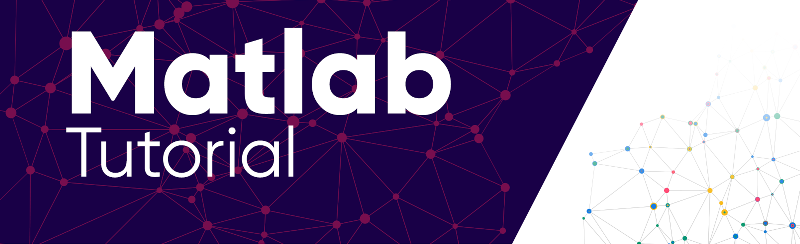

# Matlab Learn Track

 
All the files for Matlab Learn series will be available in this repository.  
🎥 <b>Find the videos available on [Youtube](https://www.youtube.com/playlist?list=PLZFNStB2gWcFqqNk8KSL69mY5y4Hl7g5Q) </b>

### :scroll: Topics to be covered
* Chapter 0 : Getting Started
* Chapter 1 : Matrix | [Code](https://github.com/Iftu119/Matlab-Learn-Track/tree/main/1.Handling%20Matrix)
* Chapter 2 : Mathematical Operations | [Code](https://github.com/Iftu119/Matlab-Learn-Track/tree/main/2.Mathematical%20Operations)
* Chapter 3 : Data Visualization | [Code](https://github.com/Iftu119/Matlab-Learn-Track/tree/main/3.%20Data%20Visualization)
* Conditional Operation
* Simulink
* Working with Data sets
* Machine Learning

⚠️ The file names here do not comply with Matlab standards.They need to be renamed before use.

⭐ Credit :  
Thumbnail Designed by [Jubair Zidan](https://www.behance.net/jubairzidan99)  
Youtube Documentation by [Shahriar Mahmud](https://www.facebook.com/shahriar.sadee)

---
